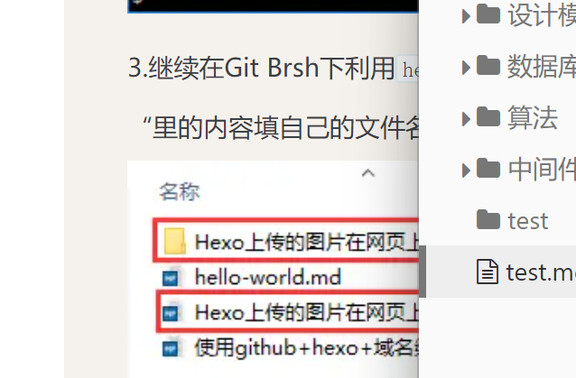

test picture:





test pic2


```undefined

```





[你好-绝对路径](test )


[你好-相对路径](/test )





[绝对路径](/中间件/kafka/kafka)

[相对路径](中间件/kafka/kafka)




fadfad


测试xmind



- Fengx
	- 任何方向
		- 编程语言
			- Java
		- SQL
		- Linux
		- Git
	- 技术
		- Java Web
		- 数据库
		- Docker
		- svn
		- 消息队列(MQ)
		- mycat
		- 大数据
			- Hadoop
			- HBase
	- 内功
		- 计算机基础
			- 计算机网络
			- 计算机操作系统
			- 编译原理
			- 计算机组成原理
		- 数据结构与算法
		- 设计模式
		- 性能优化
		- 架构设计
		- 软件工程
	- 其他
		- 英语
		- 博客
		
