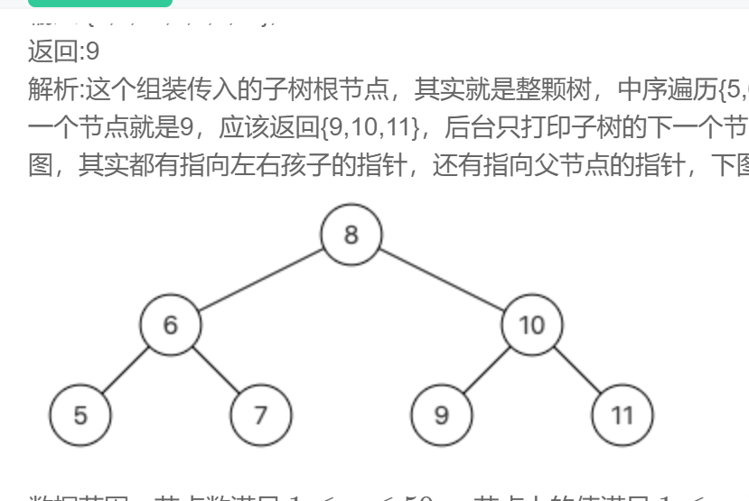

# 第一张 绪论
  首先介绍本文的设计背景---新增材料
# 第二章 
  简要说明
  ```
  #include <iostream>
  using namespace std;
  int main()
  {
	 interesting sd;
      return 0;
  }


  ```
# 第三章
  对于本文的设计需求
# 总结
范德萨发





test 图片


