> ​	[Prometheus马哥亲讲_哔哩哔哩_bilibili](https://www.bilibili.com/video/BV1PT4y1P7bX?p=1)

# 一、监控系统的前世今生

## 1.1 监控系统发展史

SNMP 监控时代

当今的监控系统

未来的监控系统

- DataOps 
- AiOps

## 1.2 监控系统组件

监控系统基本组件

- 指标数据采集
- 指标数据存储
- 指标数据趋势分析及可视化
- 告警

## 1.3  监控体系

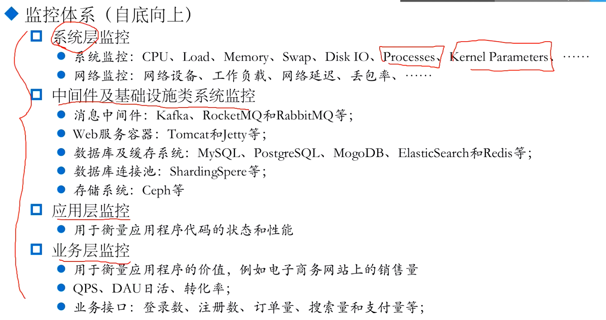

## 1.4 云原生时代的可观测性

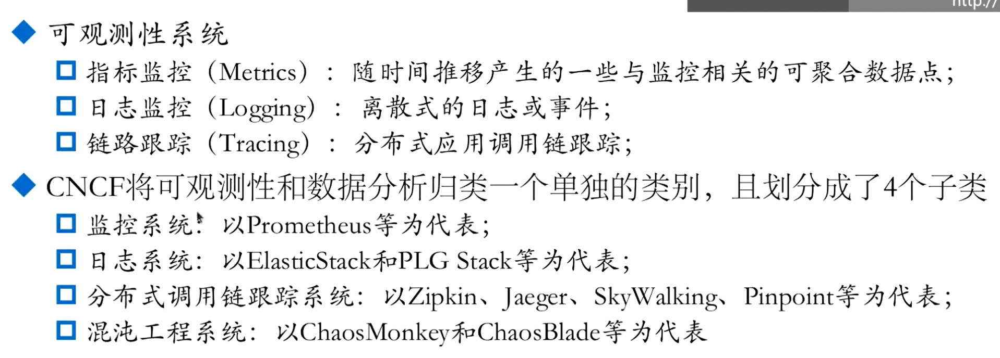

## 1.5 监控方法论

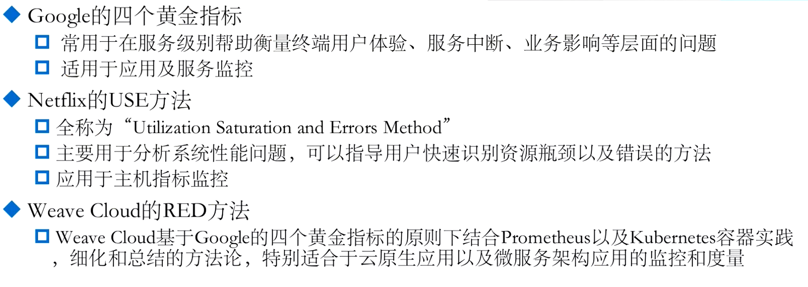

### 1.5.1 Google的四大黄金指标

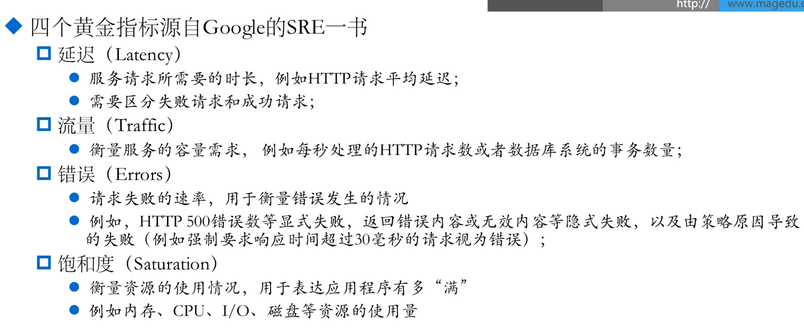

### 1.5.2Use 方法

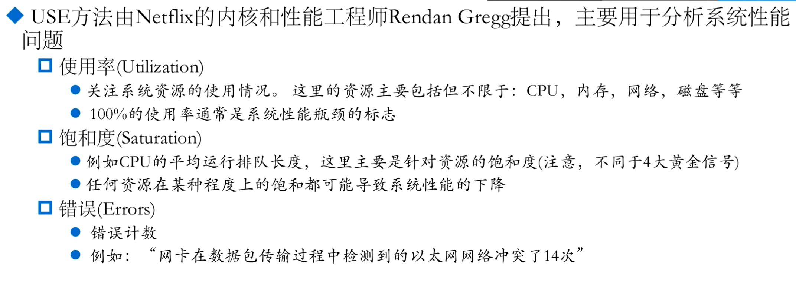

### 1.5.3RED 方法

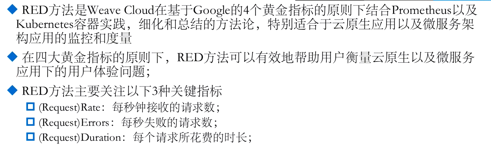

# 二 Prometheus 入门

## 2.1 prometheus 是什么

​	时序数据库TSDB

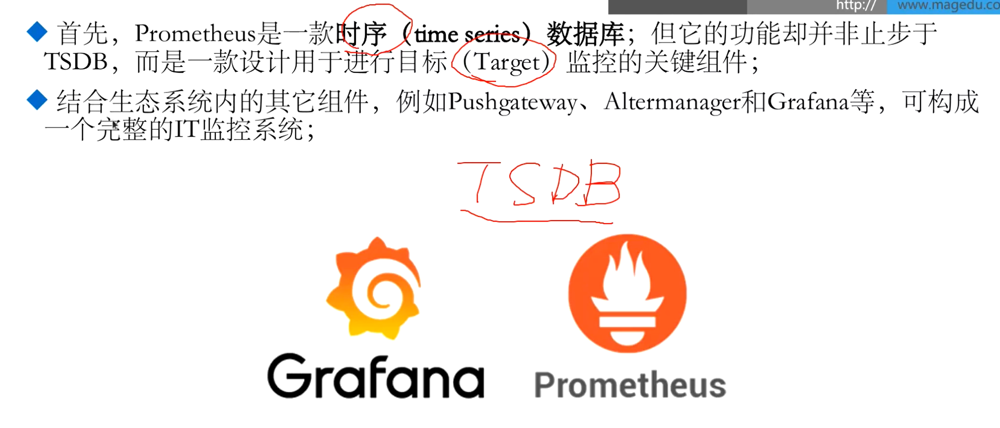

## 时序数据简介

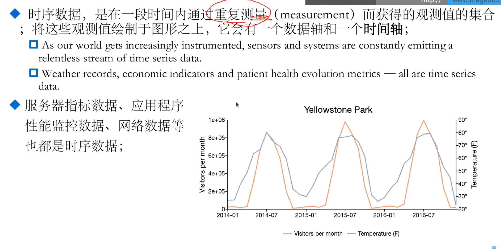

## prometheus do

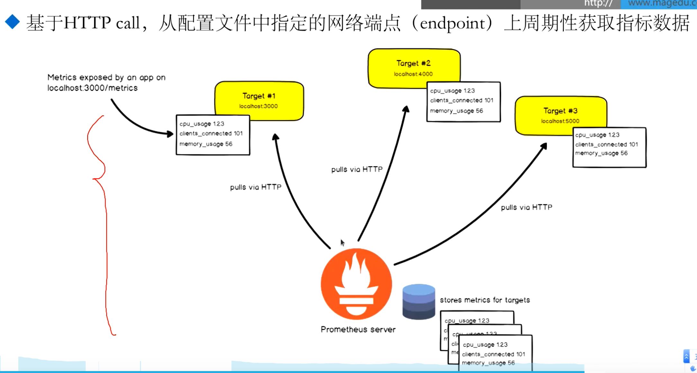

- 基于http协议
- pull 模式 作为客户端从endpoint抓取数据

白盒监控：作为一种自行方式，被监控系统内部能够自己生成指标，由监控系统采集

黑盒监控：对于目标系统没有侵入性，基于探针的方式

采用以下三种方式进行白盒监控

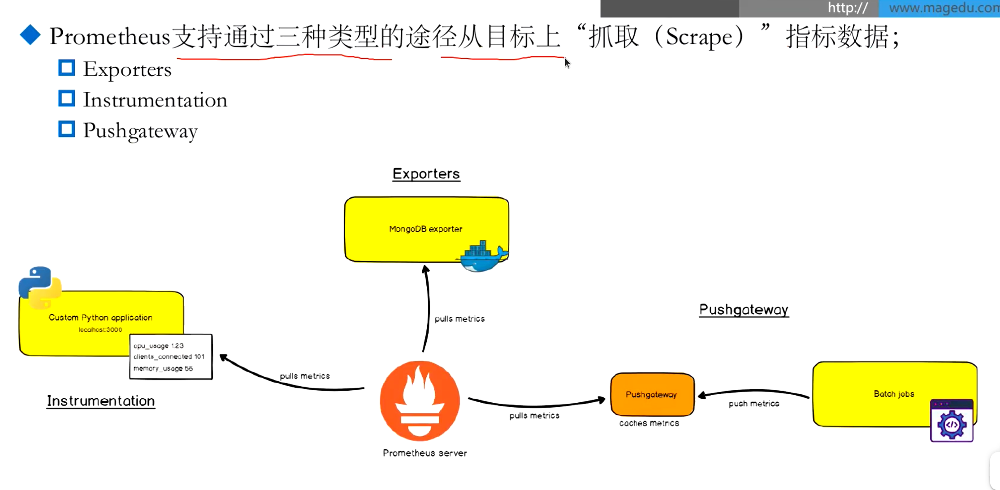

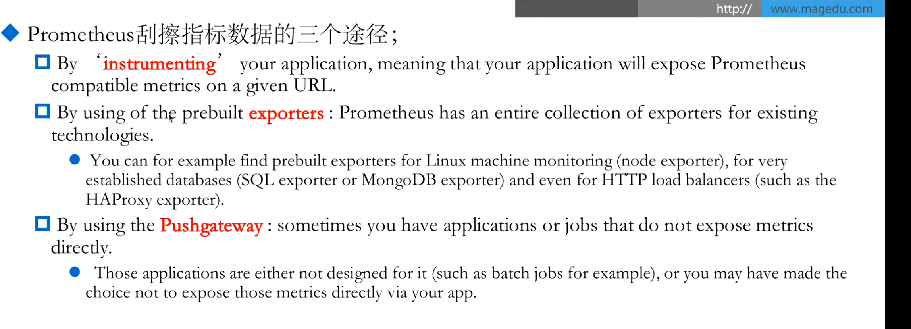

- Exporters
  - 指标获取器，作为服务的客户端，采集原始指标，转换为prometheus格式的指标数据
- instructiontation
  - 系统上报的指标符合prometheus的格式
- pushgateway
  - 瞬时应用，上报指标

## pull or push 

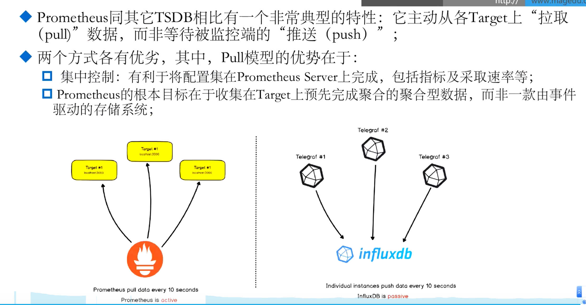

## prometheus 生态组件

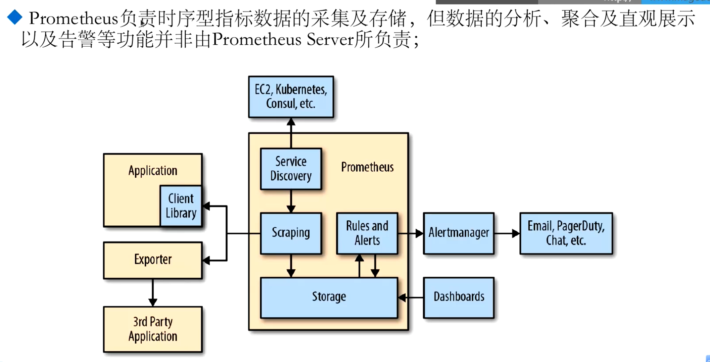

storage: TSDB 时序数据库

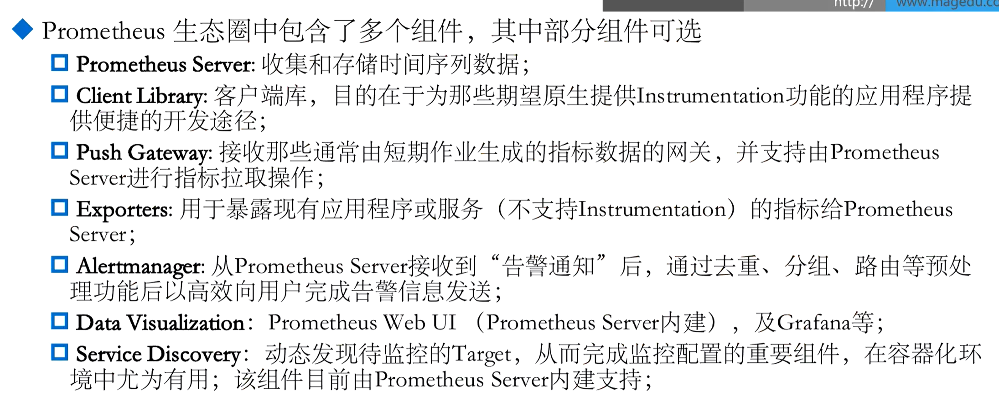

## prometheus  数据模型

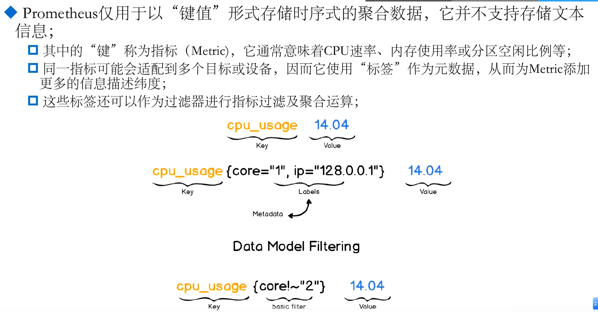

- 每个指标都会生成时序点
- 同一个指标比如cpu_usage，可能匹配三个甚至多台主机，用标签区分

## 	指标类型

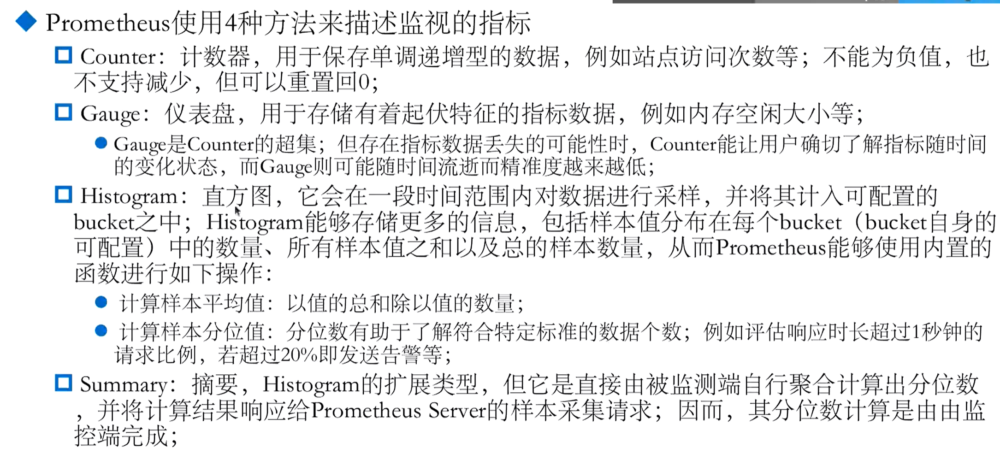

指标的数据格式：

​	

## 作业（job）和实力（instance）

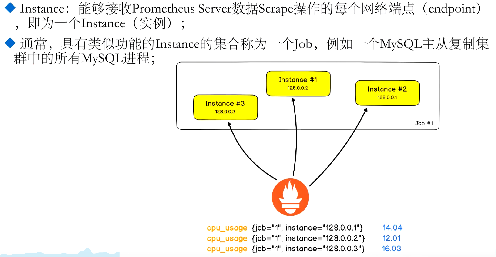

## PromQL

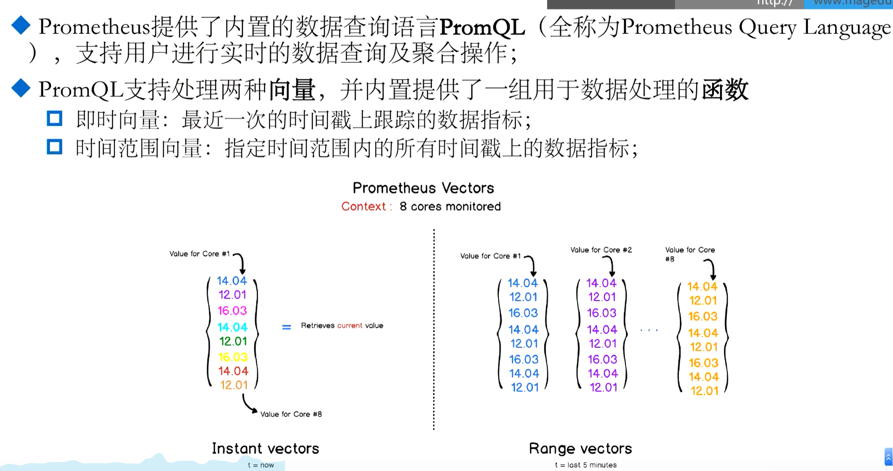

## Instrumentation (程序仪表)

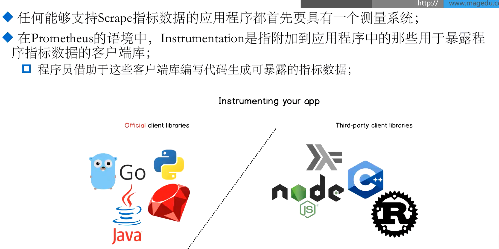

## Alerts

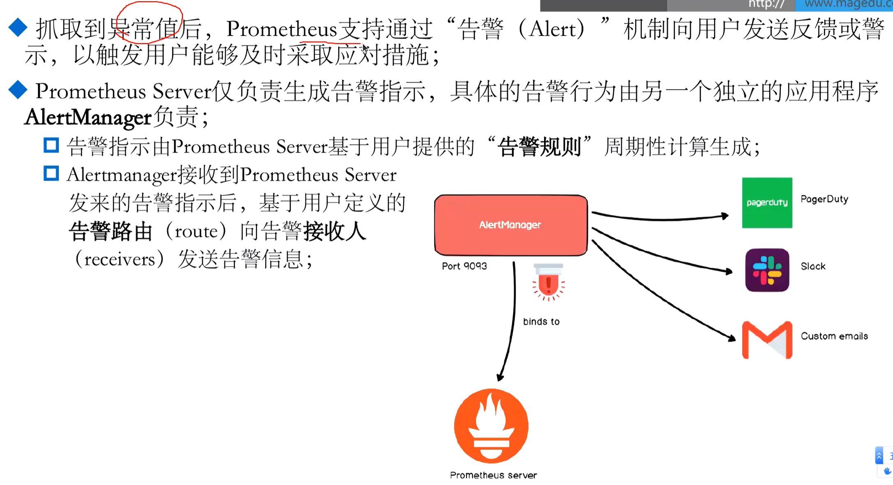

# 三 Prometheus 架构及组件

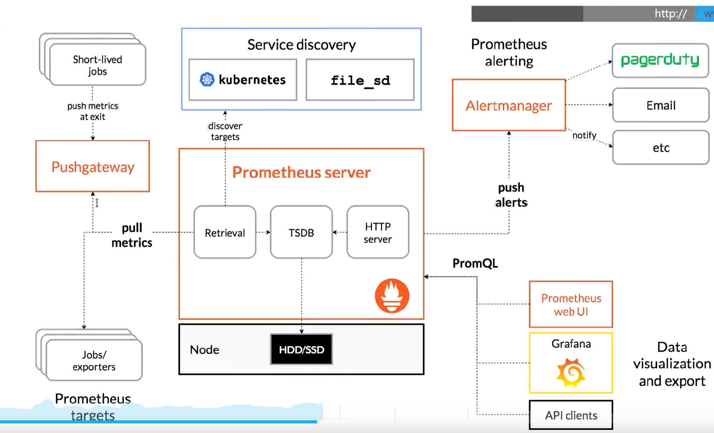

